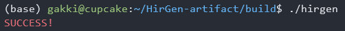
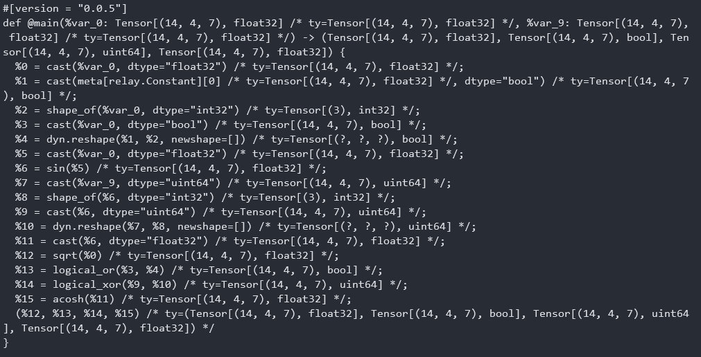
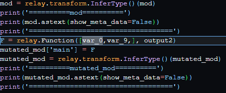
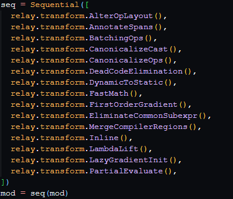
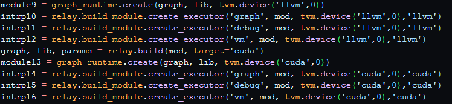

# README of HirGen-artifact 

## Getting Started

**HirGen** is an effective fuzzer for Deep Learning compilers. Specifically, it focuses on the high-level optimization stage.

The general functionality of HirGen is generating computational graphs, converting them into high-level IRs and leverage the three test oracles to test DL compilers.
The high-level IRs and the utilization of test oracles are shown in the generated `output.py`.

1. Q: How to validate the success of generating the `output.py`?
   
   A: You can see `SUCCESS!` on the terminal such as:
   
  
2. Q: How to validate that `output.py` contains the high-level IR(s)?

   A: Run `output.py` and you can see the IR on the terminal such as:
   

3. Q: How to validate that `output.py` contains the utilization of the test oracles?

   A: You can check the `output.py`. You will find

   1) The mutation of the original IR into a semantically equivalent IR. (test oracle 2):
   
   2) The use if high-level optimizations to translate the original IR into a semantically equivalent but optimized IR.
   
   3) Execution of the IR on different platforms.
   

4. Q: How to validate that HirGen can test TVM?
   A: Run `output.py`. If a test fails, you will find that
      1) TVM crashes with messages or throws segmentation fault, or
      2) different outputs among different platforms are caught, or
      3) semantically equivalent high-level IRs have different behaviors.
         


## Detailed Instructions

The following step-by-step instructions are used to create a suitable environment for building HirGen on Linux OS (take Ubuntu as example).

1. Install GCC 

    1) following this [link](https://gcc.gnu.org/install/) if you do not have root priviledges, or
    2) following these two instructions if you have root privileges:
    ```
    sudo apt update
    sudo apt install build-essential
    ```
    
    or install LLVM 
    1) following this [link](https://llvm.org/docs/GettingStarted.html) if you do not have root priviledges, or
    2) following this instruction `sudo apt install clang` if you have root privileges.

2. After installation, the absolute path of the `gcc`/`g++` command or `clang`/`clang++` command can be found by
```
which gcc
which g++
which clang
which clang++
```

3. Now you have C++ compiler(s). And you also need to have `cmake`. You can either install it following this [line](https://cmake.org/install/) if you do not have root priviledges, or following the instruction `sudo apt install cmake`.

The step-by-step instructions below are used to build the HirGen executable and execute it.

1. Create a workspace for the executable
```
mkdir build
```

2. Create Makefile
```
cmake ..
```
In this step, you may fail because of not having C++ compiler. In this case, please refer to the step-by-step instructions for installing GCC or LLVM above.

If you have multiple compilers or multiple version of a single compiler and you want to specify what compiler and which version you want to use, please add the first two statements above `set (CMAKE_CXX_STANDARD 17)` in `CMakeLists.txt`:
```
set(CMAKE_C_COMPILER {ABSOLUTE PATH OF YOUR C COMPILER})
set(CMAKE_CXX_COMPILER {ABSOLUTE PATH OF YOUR C++ COMPILER})
```
Please substitute the `{ABSOLUTE PATH OF YOUR C/C++ COMPILER}` with the real absolute paths.

3. Build
```
make
```
(Or, if you prefer ninja, you can do `cmake .. -G Ninja` in the second step and use `ninja` to build in this step)

After these three instructions, you can find the `hirgen` executable in the `build` folder.

`hirgen` provides several options for generating computational graphs.
  + `-num` specifies the number of operators, the default value is `-num=100`
  + `-testing` specifies whether perform test oracle 3 in paper, the default value is `-testing=nodf`, meaning no test oracle 3 included. In this choice, the testing process would be much faster but may miss bugs of calculation difference on difference hardware incurred by the running of model. If you want to enable test oracle 3, please run `hirgen` with `-testing=df`.
  + `-clevel` specifies the generation mode. Default option is `-clevel=strict`, meaning strict generation. You can switch it to disruptive generation by `-clevel=disruptive`.
  + -coverage` specifies whether we enable coverage guidance. The default option is `-coverage=yes`, you can switch it to `-coverage=no` to turn off guidance and make hirgen generate computational graph randomly.

To make things simple, you can direct execute it by 
```
./hirgen
```
And you will see `SUCCESS!` in the terminal if the generation succeeds. And now you can find `output.py` in the `build` folder. This is the python file that utilizes Relay's high-level APIs to create the corresponding high-level IR(s) of the generated computational graph. 

To run this python file, you need to have python on your linux. One way of doing that is installing [Miniconda](https://docs.conda.io/en/latest/miniconda.html) or installing [Anaconda](https://docs.anaconda.com/free/anaconda/install/linux/).

Besides, you need to have TVM installed
folloing this [link](https://tvm.apache.org/docs/install/from_source.html) to install it from source.
Our detected bugs could be reproduced using version `124813f` by `git checkout 124813f`. But since the 3rd party libraries of TVM are incompatible with this version, please just use the latest TVM, or use any version of TVM above 0.9 by `git checkout remotes/origin/{version}`. The {version} needs to be replaced by `v0.9.0`/`v0.10.0`, `v0.11.0`, or `v0.12.0`.

Finally, you can use the instruction
```
python output.py 
```
to run the python code.
